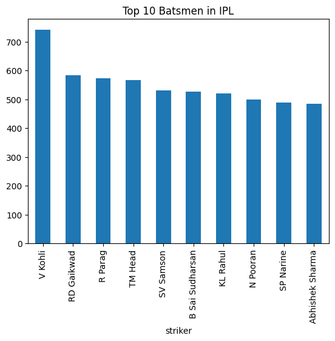
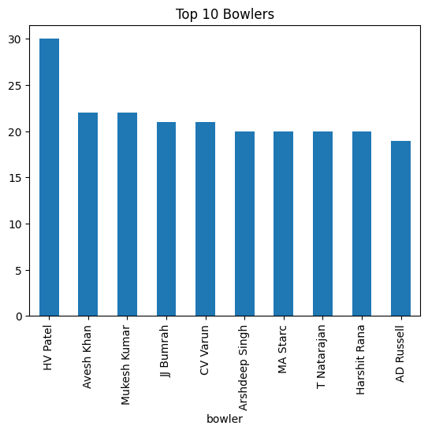
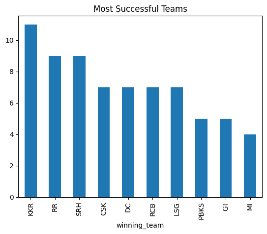

# IPL Data Analytics Project

## Overview
This project analyzes IPL cricket data using Python to extract insights about players and teams.

## Tools Used
- Python (Pandas, Matplotlib)
- Machine Learning (Random Forest)
- Google Colab

## Features
- Top batsmen analysis
- Top bowlers analysis
- Team performance insights
- Toss impact analysis
- Match prediction model

## Output
- Graphs showing player performance
- Match prediction accuracy

## How to Run
1. Open the notebook in Google Colab
2. Upload dataset (matches.csv, deliveries.csv)
3. Run all cells

## Author
Jayanth Yadav

Sample Output

### Top Batsmen

### Top Bowlers

### Team Wins

